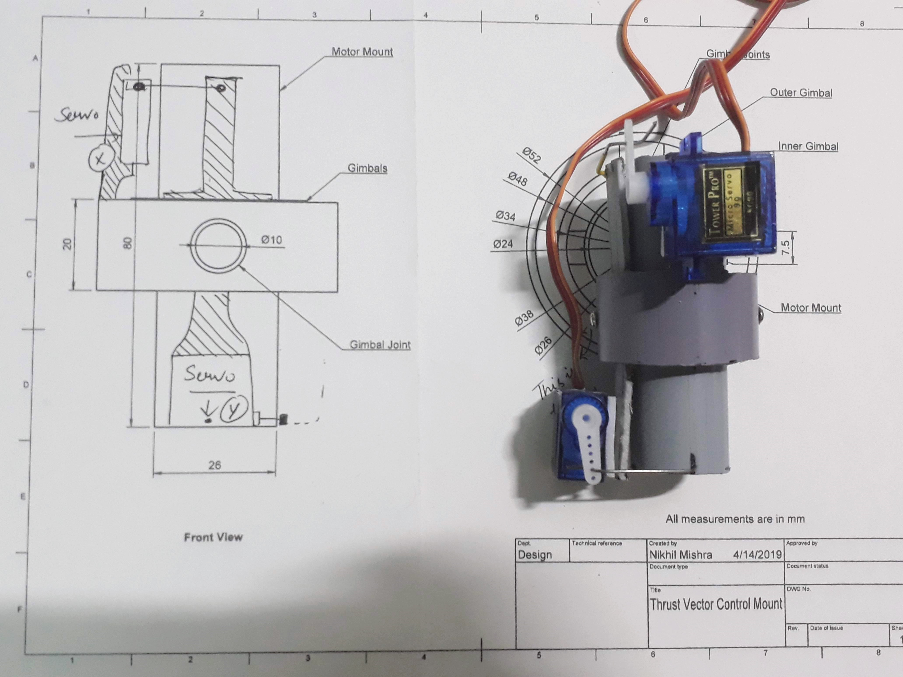
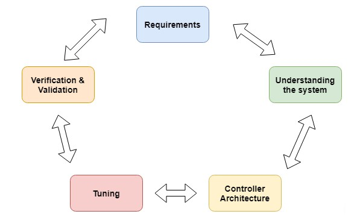

# Thrust-Vector-Control-Rocket

A model thrust vector control system to maneuver a rocket with tuned PID settings.

## TVC Development 

### Version 1

**To Work On:**
* Integrity (To handle 7 - 10Ns of force)
* Using bearings.
* Using heat Resistant and strong material.

## Design TVC 2.0

### Improvements:

* Structural integrity
* Offset Angles

## Control System Design:

### Requirements
* Speed
* Accuracy
* Range +-3 degrees
* Noise Damping
* Faster Response

### System Characteristics
* Nonlinear control design
* Closed loop
* Rotational system
* Discrete data
* Time-varying system
* The mass of the object decreases as fuel on board is being consumed during flight.

**Sources:**
 - Control Systems Engineering - Norman S. Nise

